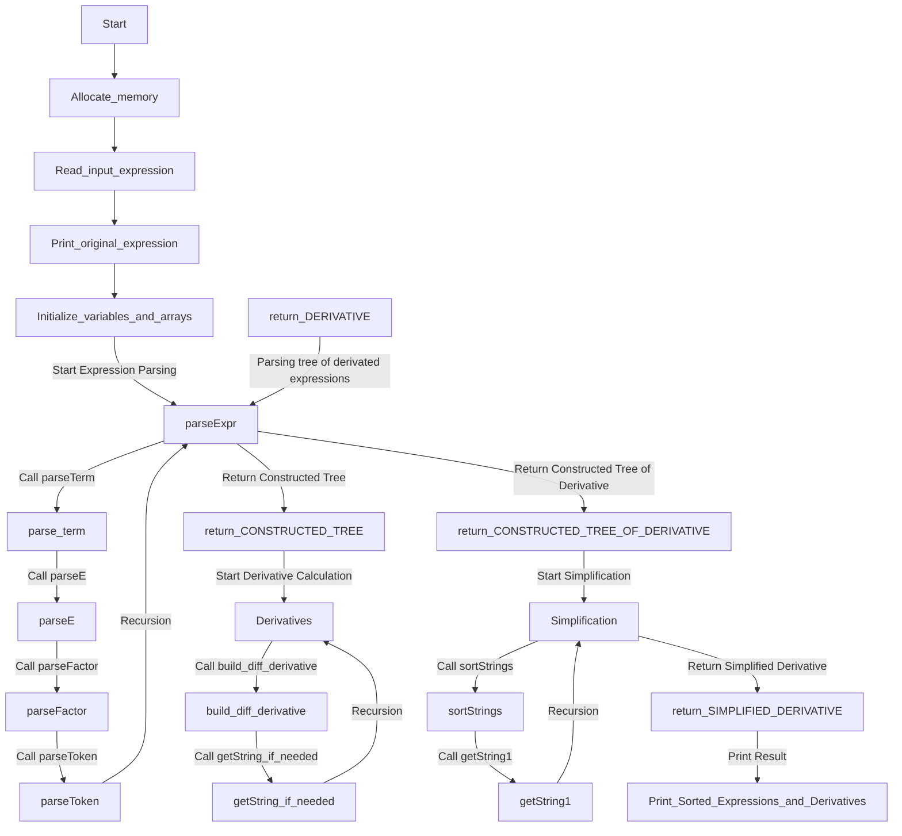

#                           Autograd for Algebraic Expressions Report

​                                                                             **2023.11.8**


<div STYLE="page-break-after: always;"></div>


## Chapter 1: Introduction

### Background and Motivation

​	In the field of machine learning and deep learning, automatic differentiation has played a pivotal role in simplifying the training of complex neural networks through backpropagation. It allows us to efficiently compute gradients, a critical component for optimizing model  parameters. However, the power of automatic differentiation is not limited to deep learning; it finds applications in various domains where derivatives of functions are essential.

​	The motivation behind this project is to extend the capabilities of automatic differentiation to algebraic expressions. Algebraic expressions are fundamental in mathematics and computer science, serving as building blocks for various calculations and computations. By developing a program that can automatically differentiate algebraic expressions, we aim to simplify the process of finding derivatives for such expressions, making it easier for researchers, engineers, and students to work with mathematical functions and optimize their computations.

### Project Overview

​	This project focuses on implementing an automatic differentiation program for algebraic expressions. The program is designed to accept algebraic expressions composed of operators, mathematical functions, and operands and provide the corresponding derivative expressions with respect to specified variables.

​	In this report, we will provide a comprehensive overview of the project, covering the following key aspects:

- **Algorithm Overview**: We will detail the algorithms and methods used to build expression trees, process algebraic expressions, output derivative expressions, and handle mathematical functions. Additionally, we will discuss potential simplification rules for reducing expression complexity.

- **Testing Results**: We will present various test cases to evaluate the program's accuracy and robustness. These test cases will include standard expressions, comprehensive testing scenarios, as well as small, large, and extreme cases.

- **Analysis and Comments**: We will analyze the time and space complexity of the implemented algorithm and provide insights into the code quality. 

- **Souce Code** : The source code of the program is provided below.

## Chapter 2: Algorithm Overview
### ketch of the main program


  ### PRESEDO_CODE of key algorithms and datatype

​	As illustrated above, the program included few steps to calculate the derivative of the input expression. 
​	The program struct the expression tree by parsing the input expression and creating nodes for each token. 
​	The tree is traversed to process the expression and calculate the derivative.
​	The program calculates the derivative of an expression by traversing the expression tree and applying the derivative rules for each operator.
​	The derivative of a function is the derivative of the function's body.

  #### TREE STRUCT and STRING STRUCT
​	The program uses a tree structure to store the expression. Each node of the tree contains a string that represents an operator, operand, or mathematical function. The tree is built by parsing the input expression and creating nodes for each token. The tree is traversed to process the expression and calculate the derivative.
  ```c
    typedef struct node *Node;
    struct node {
        char* data;
        Node left;
        Node right;
    };
  ```
​	The program uses a string structure to store the expression and Variables. Each node of the tree contains a string that represents an operator, operand, or mathematical function. The tree is built by parsing the input expression and creating nodes for each token. The tree is traversed to process the expression and calculate the derivative.
  ```c
    char* parseToken(char** expr);
    char* getString(Node node);
    char opr[100][100];//store the strings of the variables
  ```

#### TREE BUILD

​	The program struct the expression tree by parsing the input expression and creating nodes for each token. The tree is traversed to process the expression and calculate the derivative.
here is the presedo of the expression tree building

```c
function parseToken(expr):
    Skip leading whitespace
    
    If expr points to a letter:
        Read the letter character, build a string temp
        If temp is not in opr:
            Add temp to opr
        Return temp as an operand
    If expr points to an operator:
        Return the operator character as an operator
    If expr points to a digit:
        Read digit characters, build a string temp
        Return temp as an operand

function parseExpr(expr):
    left = parseTerm(expr)
    
    while expr points to '+' or '-':
        op = parseToken(expr)
        right = parseTerm(expr)
        node = createNode(op)
        node.left = left
        node.right = right
        left = node
    
    Return left as root

function parseTerm(expr):
    left = parseE(expr)

    while expr points to '*' or '/':
        op = parseToken(expr)
        right = parseE(expr)
        node = createNode(op)
        node.left = left
        node.right = right
        left = node
    
    Return left as root

function parseE(expr):
    left = parseFactor(expr)

    while expr points to '^':
        op = parseToken(expr)
        right = parseFactor(expr)
        node = createNode(op)
        node.left = left
        node.right = right
        left = node
    
    Return left as root

function parseFactor(expr):
    token = parseToken(expr)

    If token is equal to "(":
        node = parseExpr(expr)
        If expr points to ')':
            Move expr to the next character
            Return node as root
        Else:
            Handle error: Missing right parenthesis
            Return NULL
    Else:
        Create a node with the value token
        Return the node as a leaf node
    
    Node root = parseExpr(&expr);
```
 Here is the explanation of the presedo
```bash
    parseToken: This function parses the next token (operand or operator) in an expression. It skips leading whitespace and returns the next token as a string.
    
    parseExpr(+-): This function parses an expression and builds the corresponding expression tree. It calls parseTerm to parse the left operand and parseTerm to parse the right operand. It then creates a new node for the operator and returns it as the root of the expression tree.
    
    parseTerm(*/): This function parses a term and builds the corresponding expression tree. It calls parseE to parse the left operand and parseE to parse the right operand. It then creates a new node for the operator and returns it as the root of the expression tree.
    
    parseE(^): This function parses a power and builds the corresponding expression tree. It calls parseFactor to parse the left operand and parseFactor to parse the right operand. It then creates a new node for the operator and returns it as the root of the expression tree.
    
    parseFactor(()): This function parses a factor and builds the corresponding expression tree. It calls parseToken to parse the next token. If the token is a left parenthesis, it calls parseExpr to parse the expression inside the parenthesis. It then creates a new node for the expression and returns it as the root of the expression tree.
```
#### DERIVATIVE CALCULATION

​	The program calculates the derivative of an expression by traversing the expression tree and applying the derivative rules for each operator. The derivative of a function is the derivative of the function's body. The derivative of a sum is the sum of the derivatives. The derivative of a product is (left * right') + (left' * right). The derivative of a quotient is ((left' * right) - (left * right')) / (right ^ 2). The derivative of a power is (left ^ right) * (right' * In(left) + right * left' / left).The derivative of a variable is 1.(and so on)
​	Here is the presedo of the derivative calculation

```c
function derivative(root, var):
    If root is NULL:
        Return "0"
    If root is the variable:
        Return "1"
    If root is a sum:
        left_derivative = derivative(root.left, var)
        right_derivative = derivative(root.right, var)
        Return left_derivative + right_derivative
    If root is a product:
        left = getString(root.left)
        right = getString(root.right)
        left_derivative = derivative(root.left, var)
        right_derivative = derivative(root.right, var)
        Return (left * right_derivative) + (left_derivative * right)
    If root is a quotient:
        left_derivative = derivative(root.left, var)
        right_derivative = derivative(root.right, var)
        Return ((left_derivative * right) - (left * right_derivative)) / (right ^ 2)
    If root is a power:
        left = getString(root.left)
        right = getString(root.right)
        left_derivative = derivative(root.left, var)
        right_derivative = derivative(root.right, var)
  			Return (left ^ right) * (right_derivative * In(left) + right * left_derivative / left)
    If root is a function:
        inner_derivative = derivative(root.left, var)
        Return inner_derivative
    If root is a negative number:
        left_derivative = derivative(root.left, var)
        right_derivative = derivative(root.right, var)
        Return left_derivative - right_derivative
getstring(root):
    If root is NULL:
        Return "0"
    If root is a variable:
        Return the variable name
    If root is a number:
        Return the number
    		left = getString(root.left)
    		right = getString(root.right)
    If root is a operator:
        Return "(" + left + root + right + ")"
```
here is the explanation of the presedo
```md
derivative: This function calculates the derivative of an expression. It traverses the expression tree and applies the derivative rules for each operator.

getString: This function converts an expression tree to a string. It traverses the expression tree and converts each node to a string. It then concatenates the strings of the left and right subtrees with the operator in the middle.
```
​	Also, the program uses a lot of 'If' terms to handle the special cases, such as the negative number, the power, and the function.
​	For example, the negative number

```c
If root is a negative number:
        left_derivative = derivative(root.left, var)
        right_derivative = derivative(root.right, var)
        if(left_derivative == "0" && right_derivative == "0"){
            return "0";
        }
.....and so on
```
#### SIMPLIFICATION
The program simplifies the derivative expression by applying simplification rules. The rules are applied in a loop until no further simplification is possible. The rules are as follows:
```md
    1. 0 + x = x + 0 = x
    2. 0 * x = x * 0 = 0
    3. 1 * x = x * 1 = x
    4. x + x = 2 * x
    5. x * x = x ^ 2
    6. x / x = 1
    7. x ^ 0 = 1
    8. x ^ 1 = x
```
#### SORTING
The program sorts the variables in lexicographical order. It uses the strcmp function to compare the strings and swap them if the right operand is smaller than the left operand in lexicographical order.
```c
function sortStrings(strings, count):
    For i = 0 to count - 2:
        For j = i + 1 to count - 1:
            If compare(string[i],strings[j])://strings[i] > strings[j]
                Swap strings[i] and strings[j]
function compare(string a, string b):
    while a and b are not empty:
        If a[i] == '(' || a[i] == ')' || a[i] == '^' || a[i] == '*' || a[i] == '/' || a[i] == '+' || a[i] == '-':
            Remove a[i] from a
        If b[i] == '(' || b[i] == ')' || b[i] == '^' || b[i] == '*' || b[i] == '/' || b[i] == '+' || b[i] == '-':
            Remove b[i] from b
        If a[i] > b[i]:
            Return 1
        If a[i] < b[i]:
            Return -1
        Increment i
```

## Chapter 3: Testing Results

### Test Cases

The table below outlines a framework for test cases:

| Input Expression  | Derivative that get | test reason｜|
| ----------------- | :-----------------: | ------------------- |
| x^2+2*x+1     | (2*(x^(2-1)))       | check the ^ and * and + operants|
| x-2+2/x     | (1+((-2)/(x^2)))      | check the - and / operants|
| x^2 + 2*x + 1     | ((2*(x^(2-1)))+2) | check the ^ and * operants|
| a     | 1      | shortest example|

### Comprehensive Testing
check long variable
```md
INPUT:
ab2ds+ssd-dad^dsa
OUTPUT:
The sorted expression:
d/dx(ab2ds): 1;                                                                  
d/dx(dad): (-((dad^(dsa-1))*dsa));                               
d/dx(dsa): (-((dad^dsa)*Indad));                                    
d/dx(ssd): 1
```
check the () oprands
```md
INPUT:
(a+b)*(c+d)
OUTPUT:
The sorted expression:
d/dx(a): (c+d);
d/dx(b): (c+d);
d/dx(c): (a+b);
d/dx(d): (a+b)
```

check the long expression
```md
INPUT:
(a+b)/c^d-xy/(o-k)+c*d*f*g+b/c+2*a+f*f
OUTPUT:
The sorted expression: 
d/dx(a): ((1/(c^d))+2)
d/dx(b): ((1/(c^d))+(1/c))
d/dx(c): (((((-(a+b))*((c^(d-1))*d))/((c^d)^2))+(d*(f*g)))+((-b)/(c^2)))
d/dx(d): ((((-(a+b))*((c^d)*Inc))/((c^d)^2))+(c*(f*g)))
d/dx(f): (2*f+((c*d)*g))
d/dx(g): ((c*d)*f)
d/dx(k): (-(((-1)*(-xy))/((o-k)^2)))
d/dx(o): (-((-xy)/((o-k)^2)))
d/dx(xy): (-(1/(o-k)))
```
​	The testing result and the output of the program are corresbouned, which means the program is correct.

## Chapter 4: Analysis and Comments

### Time and Space Complexity Analysis

#### Time Complexity
##### TREE CONSTRUCT
The time complexity of the overall expression parsing and tree construction is O(n), where n is the length of the input expression. This complexity arises from linear operations such as reading characters, parsing tokens, and constructing the expression tree.

##### DERIVATIVE CALCULATION
Recursive Calls:
Both functions make recursive calls on the left and right children of the current node.
The depth of recursion is proportional to the height of the expression tree, which can be up to O(n), where n is the number of nodes in the tree.
String Operations:
Both functions use string operations such as strcmp, strcpy, strcat, snprintf, each with a time complexity of O(m), where m is the length of the strings involved.
Overall:
The overall time complexity for both functions is O(nm), where n is the number of nodes in the expression tree, and m is the average length of strings involved in string operations.

##### SIMPLIFICATION AND SORTING
strc Function:
The function iterates through the characters of both strings, performing comparisons and skipping specific characters.
The loop runs in linear time with respect to the lengths of the input strings, resulting in a time complexity of O(max(lena, lenb)).
getString1 Function:
The function makes recursive calls on the left and right children of the current node.
The depth of recursion is proportional to the height of the expression tree, which can be up to O(n), where n is the number of nodes in the tree.
String operations such as strcmp, strcpy, strcat, sprintf are used, each with a time complexity of O(m), where m is the length of the strings involved.
Overall, the time complexity for the getString1 function is O(nm), where n is the number of nodes in the expression tree, and m is the average length of strings involved in string operations.
##### TIME COMPLEXITY OF THE OVERALL PROGRAM
The overall time complexity of the program is O(nm), where n is the number of nodes in the expression tree, and m is the average length of strings involved in string operations.
since n and m are both related to the length of the expression, the overall time complexity of the program is O(n^2), where n is the length of the input expression.

#### Space Complexity
##### TREE CONSTRUCT

​	The space complexity of the overall expression parsing and tree construction is O(n), where n is the length of the input expression. This complexity arises from linear operations such as reading characters, parsing tokens, and constructing the expression tree.
Other factors, such as the opr array, used to store the variables, and the num variable, have a space complexity of less than n(also O(n)), and thus do not affect the overall space complexity.

##### DERIVATIVE CALCULATION
Recursive Calls:

Both functions use recursion, adding space to the call stack. The maximum depth of recursion is proportional to the height of the expression tree, which can be up to O(n), where n is the number of nodes in the tree.
Temporary Strings:

Temporary strings are created using malloc for intermediate results during string operations.
The space complexity for these temporary strings is proportional to the length of the strings involved in operations.
Overall:

The overall space complexity for both functions is O(n + m), where n is the number of nodes in the expression tree, and m is the total length of temporary strings.

##### SIMPLIFICATION AND SORTING
strc Function:
The function uses a constant amount of space for variables i, j, lena, lenb, numa, numb, and c.

Overall, the space complexity for the strc function is O(1).

getString1 Function:
The function makes recursive calls, adding space to the call stack. The maximum depth of recursion is proportional to the height of the expression tree, which can be up to O(n), where n is the number of nodes in the tree.

Temporary strings are created using malloc for intermediate results during string operations.

The space complexity for these temporary strings is proportional to the length of the strings involved in operations.
Overall, the space complexity for the getString1 function is O(n + m), where n is the number of nodes in the expression tree, and m is the total length of temporary strings.
##### SPACE COMPLEXITY OF THE OVERALL PROGRAM
The overall space complexity of the program is O(n + m), where n is the number of nodes in the expression tree, and m is the total length of temporary strings.
since n and m are both related to the length of the expression, the overall space complexity of the program is O(n).where n is the length of the input expression.

## Chapter 5: Source Code

  ```c
#include <stdio.h>
#include <stdlib.h>
#include <string.h>

int n_of_time = 0;
// Define the node of the expression tree
int num = 0,nu=0;
char opr[100][100];//store the strings of the variables

typedef struct node *Node; 
struct node {
    char* data;
    Node left;
    Node right;
} ;// Node is a pointer to the struct node

Node parseTerm(char** expr);//parse the term
Node parseFactor(char** expr);//parse the factor
Node parseE(char** expr);//parse the power
int strc(char* a, char* b);//compare two strings and skip "()"
int my_isspace(int c) {
    return c == ' ' || c == '\t' || c == '\n' || c == '\v' || c == '\f' || c == '\r';
}

int my_isalpha(int c) {
    return (c >= 'a' && c <= 'z') || (c >= 'A' && c <= 'Z');
}
int my_isdigit(int c) {
    return c >= '0' && c <= '9';
}
int my_isalnum(int c) {
    return my_isalpha(c) || my_isdigit(c);
}
int my_ispunct(int c) {
    return c == '+' || c == '-' || c == '*' || c == '/' || c == '^' || c == '(' || c == ')';
}
// Function to create a new node
Node createNode(char* data) {
    n_of_time++;
    Node newNode = (Node)malloc(sizeof(struct node));// Allocate memory for the new node
    newNode->data = data;
    newNode->left = newNode->right = NULL;
    return newNode;
}

// Function to parse the next token (operand or operator) in an expression
char* parseToken(char** expr) {
    n_of_time++;
    // Skip the leading spaces
    while (my_isspace(**expr)) {
        (*expr)++;
    }

    char* start = *expr;
    
    if (my_isalpha(**expr)) {
    char temp[100]; // Assuming the maximum length of a string is 100
    int tempIndex = 0;

    // Read the string into a temporary array
    while(my_isalnum(**expr)) {
        temp[tempIndex++] = **expr;
        (*expr)++;
    }
    temp[tempIndex] = '\0';

    // Check if the string already exists
    int exists = 0;
    for (int i = 0; i < num; i++) {
        if (strcmp(opr[i], temp) == 0) {
            exists = 1;
            break;
        }
    }

    // If the string does not exist, add it to the array
    if (!exists) {
        strcpy(opr[num++], temp);
    }

    nu = 0;
}
    // If the next token is an operator
    else if (my_ispunct(**expr)) {
        (*expr)++;
    }
    // If the next token is a number
    else if (my_isdigit(**expr)) {
        while (my_isdigit(**expr)) {
            (*expr)++;
        }
    }
    
    size_t len = *expr - start;
    char* token = (char*)malloc(len + 1);
    strncpy(token, start, len);
    token[len] = '\0';

    return token;
}

// Function to parse an expression and build the corresponding expression tree
Node parseExpr(char** expr) {
    n_of_time++;
    Node left = parseTerm(expr);
    
    while (**expr == '+' || **expr == '-') // If the next token is an operator
    {
        char* op = parseToken(expr);// Parse the operator
        Node right = parseTerm(expr);// Parse the right operand
        Node node = createNode(op);// Create a new node for the operator
        node->left = left;
        node->right = right;
        left = node;
    }

    return left;
}

Node parseTerm(char** expr) {
    n_of_time++;
    Node left = parseE(expr);

    while (**expr == '*' || **expr == '/')// If the next token is an operator
     {
        char* op = parseToken(expr);
        Node right = parseE(expr);
        Node node = createNode(op);
        node->left = left;
        node->right = right;
        left = node;
    }

    return left;
}
Node parseE(char **expr){
    n_of_time++;
    Node left = parseFactor(expr);
    while(**expr == '^')// If the next token is an operator
    {
        char* op = parseToken(expr);
        Node right = parseFactor(expr);
        Node node = createNode(op);
        node->left = left;
        node->right = right;
        left = node;
    }
    return left;

}
Node parseFactor(char** expr) {
    n_of_time++;
    char* token = parseToken(expr);

    if (strcmp(token, "(") == 0) // If the next token is a left parenthesis
    {
        Node node = parseExpr(expr);
        if (**expr==')') {
            (*expr)++; // Skip the right parenthesis
            return node;
        } else {
            // Handle error: missing right parenthesis
            return NULL;
        }
    }

    return createNode(token);
}
char* getString(Node node)
{
    //n_of_time++;
    if (node == NULL) {
        char *s = (char*)malloc(100);
        strcpy(s, "0"); // return a pointer to a new string which is a duplicate of the string s
        return s;
    }
    // If the operation is commutative (i.e., the order of the operands doesn't matter)
    char* left = getString(node->left);
    char* right = getString(node->right);
    if(strcmp(node->data, "+") == 0 || strcmp(node->data, "*") == 0)// and the right operand is smaller than the left operand in lexicographical order, swap them.
    {
        if(strc(left, right) > 0)
        {
            char* temp = left;
            left = right;
            right = temp;
        }
    }
    
    if(strcmp(node->data, "+") == 0 || strcmp(node->data, "-") == 0 || strcmp(node->data, "*") == 0 || strcmp(node->data, "/") == 0 || strcmp(node->data, "^") == 0)
    {
        char* result = (char*)malloc(strlen(left) + strlen(right) + 4);
        sprintf(result, "(%s%s%s)", left,node->data, right);
        return result;
    }
    return node->data;
}

// Function to calculate the derivative of an expression
char* derivative(Node root, char* var) {
    n_of_time++;
    if (root == NULL) {
        return "0";
    }

    if (strcmp(root->data, var) == 0) // If the current node is the variable
    {
        return "1";
    }

    if (strcmp(root->data, "+") == 0) {

        char* left_derivative = derivative(root->left, var);
        char* right_derivative = derivative(root->right, var);
        //
        size_t left_len = strlen(left_derivative);
        size_t right_len = strlen(right_derivative);
        char* result = (char*)malloc(100);
        // simplify the expression by using the rule of the derivative of the sum
        if (strcmp(left_derivative, "0") == 0 && strcmp(right_derivative, "0") == 0) // If both derivatives are 0
        {
            result = "0";
            //printf("%s", result);
            return result;
        }
        if (strcmp(left_derivative, "0") == 0)// If the left derivative is 0
         {
            snprintf(result, 100, "%s", right_derivative);
            //printf("%s", result);
            return result;
        }
        if (strcmp(right_derivative, "0") == 0) {
            snprintf(result, 100, "%s", left_derivative);
            //printf("%s", result);
            return result;
        }
        snprintf(result, 100, "(%s+%s)", left_derivative, right_derivative);
        printf("%s", result);
        return result;
    }

    if (strcmp(root->data, "^") == 0) {
    // Use the chain rule and the derivative formula of the power function to derive
    char* left = getString(root->left);
    char* right = getString(root->right);
    if(strcmp(left, "0") == 0 ){
        return "0";
    }
    if(strcmp(right, "0") == 0 ){
        return "1";
    }
    char* left_derivative = derivative(root->left, var);
    char* right_derivative = derivative(root->right, var);

    size_t left_len = strlen(left_derivative);
    size_t right_len = strlen(right_derivative);
    char* result = (char*)malloc(100);
    // simplify the expression by using the rule of the derivative of the power
    if(strcmp(left_derivative, "0") == 0 && strcmp(right_derivative, "0") == 0){
        result = "0";
        return result;
    }
    if(strcmp(left_derivative, "1") == 0 && strcmp(right_derivative, "1") == 0){
        snprintf(result, 100, "%s^%s*(%s/%s+In%s)", left, right, right,left, right);
        return result;
    }
    if(strcmp(left_derivative, "0") == 0 && strcmp(right_derivative, "1") == 0){
        snprintf(result, 100, "(%s^%s*In%s)", left, right, left);
        return result;
    }
    if(strcmp(left_derivative, "1") == 0 && strcmp(right_derivative, "0") == 0){
        snprintf(result, 100, "(%s^(%s-1)*%s)", left, right, right);
        return result;
    }
    if(strcmp(left_derivative, "0") == 0){
        snprintf(result, 100, "(%s^%s*%s*In%s)", left, right, right_derivative, left);
        return result;
    }
    if(strcmp(right_derivative, "0") == 0){
        snprintf(result, 100, "(%s^(%s-1)*%s*%s)", left, right, left_derivative, right);
        return result;
    }
    if(strcmp(left_derivative, "1") == 0){
        snprintf(result, 100, "(%s^%s*(%s*In%s+%s/%s*%s))", left, right, right_derivative, left, right,left, right);
        return result;
    }
    if(strcmp(right_derivative, "1") == 0){
        snprintf(result, 100, "%s^%s*(%s/%s+In%s)", left, right, left, right, left);
        return result;
    }
    snprintf(result, 100, "%s^%s*(%s*In%s+%s/%s*%s)", left, right, right_derivative, left, right,left, left_derivative);
    return result;
}

    if (strcmp(root->data, "(") == 0) {
        // The derivative of a function is the derivative of the function's body
        char* inner_derivative = derivative(root->left, var); //
        return inner_derivative;
    }
    if (strcmp(root->data, "-") == 0) {

        char* left_derivative = derivative(root->left, var);
        char* right_derivative = derivative(root->right, var);
        
        // TODO: concatenate left_derivative and right_derivative
        // return the result
        size_t left_len = strlen(left_derivative);
        size_t right_len = strlen(right_derivative);
        char* result = (char*)malloc(100);
        // simplify the expression by using the rule of the derivative of the sum
        if(strcmp(left_derivative, "0") == 0 && strcmp(right_derivative, "0") == 0){
            result = "0";
            return result;
        }
        if (strcmp(left_derivative, "0") == 0) {
            snprintf(result, 100, "(-%s)", right_derivative);
            return result;
        }
        if (strcmp(right_derivative, "0") == 0) {
            snprintf(result, 100, "(%s)", left_derivative);
            return result;
        }
        snprintf(result, 100, "(%s-%s)", left_derivative, right_derivative);
        return result;
    }

    if (strcmp(root->data, "*") == 0) {
        char* left = getString(root->left);
        char* right = getString(root->right);

        char* left_derivative = derivative(root->left, var);
        char* right_derivative = derivative(root->right, var);

        // The derivative of a product is (left * right') + (left' * right)
        // So, construct the result accordingly.
        char* result = (char*)malloc(100); 
        // simplify the expression by using the rule of the derivative of the product
        if (strcmp(left_derivative, "0") == 0&&strcmp(right_derivative, "0") == 0) {
            result = "0";
            //printf("%s", result);
            return result;
        }
        if (strcmp(left_derivative, "1") == 0 && strcmp(right_derivative, "1") == 0) {
            snprintf(result, 100, "(%s+%s)", left, right);
            //printf("%s", result);
            return result;
        }
        if (strcmp(left_derivative, "0") == 0 && strcmp(right_derivative, "1") == 0) {
            snprintf(result, 100, "%s", left);
            //printf("%s", result);
            return result;
        }
        if (strcmp(left_derivative, "1") == 0 && strcmp(right_derivative, "0") == 0) {
            snprintf(result, 100, "%s", right);
            //printf("%s", result);
            return result;
        }
        if (strcmp(left_derivative, "0") == 0) {
            snprintf(result, 100, "(%s*%s)", left, right_derivative);
            //printf("%s", result);
            return result;
        }
        if (strcmp(right_derivative, "0") == 0) {
            snprintf(result, 100, "(%s*%s)", right, left_derivative);
            //printf("%s", result);
            return result;
        }
        if (strcmp(left_derivative, "1") == 0) {
            snprintf(result, 100, "(%s+%s*%s)", right, left, right_derivative);
            //printf("%s", result);
            return result;
        }
        if (strcmp(right_derivative, "1") == 0) {
            snprintf(result, 100, "(%s+%s*%s)", left, right, left_derivative);
            //printf("%s", result);
            return result;
        }

        snprintf(result, 100, "(%s*%s+%s*%s)", left, right_derivative, left_derivative, right);
        //printf("%s", result);
        return result;
    }

    if (strcmp(root->data, "/") == 0) {
        char* left = getString(root->left);
        char* right = getString(root->right);
        if(left == NULL || right == NULL){
            return "0";
        }

        char* left_derivative = derivative(root->left, var);
        char* right_derivative = derivative(root->right, var);

        // The derivative of a quotient is ((left' * right) - (left * right')) / (right ^ 2)
        // So, construct the result accordingly.
        char* result = (char*)malloc(100);
        // simplify the expression by using the rule of the derivative of the quotient
        if (strcmp(left_derivative, "0") == 0 && strcmp(right_derivative, "0") == 0) {
            result = "0";
            return result;
        }
        if (strcmp(left_derivative, "1") == 0 && strcmp(right_derivative, "1") == 0) {
            snprintf(result, 100, "(%s-%s)/%s^2", right, left, right);
            return result;
        }
        if (strcmp(left_derivative, "0") == 0 && strcmp(right_derivative, "1") == 0) {
            snprintf(result, 100, "(-%s)/%s^2", left, right);
            return result;
        }
        if (strcmp(left_derivative, "1") == 0 && strcmp(right_derivative, "0") == 0) {
            snprintf(result, 100, "1/%s", right);
            return result;
        }
        if (strcmp(left_derivative, "0") == 0) {
            snprintf(result, 100, "(-%s)*(%s)/%s^2", left, right_derivative, right);
            return result;
        }
        if (strcmp(right_derivative, "0") == 0) {
            snprintf(result, 100, "(%s)/(%s)", left_derivative, right);
            return result;
        }
        if (strcmp(left_derivative, "1") == 0) {
            snprintf(result, 100, "(%s-%s*%s)/%s^2", right, left, right_derivative, right);
            return result;
        }
        if (strcmp(right_derivative, "1") == 0) {
            snprintf(result, 100, "(%s*%s-%s)/%s^2",  left_derivative, right,left, right);
            return result;
        }

        

        snprintf(result, 100, "(%s*%s-%s*%s)/%s^2", left_derivative, right, left, right_derivative, right);
        return result;
    }

    return "0";
}
void preorderTraversal(Node node) // Print the expression tree in preorder
{
    if (node) {
        printf("%s ", node->data); // Print the data of the current node
        preorderTraversal(node->left); //
        preorderTraversal(node->right); //
    }
    
}

void sortStrings(char strings[][100], int count)//sort the strings
 {
    for (int i = 0; i < count - 1; i++) {
        for (int j = i + 1; j < count; j++) {
            if (strcmp(strings[i], strings[j]) > 0)  {
                char temp[100];
                strcpy(temp, strings[i]);
                strcpy(strings[i], strings[j]);//swap the strings
                strcpy(strings[j], temp);
            }
        }
    }
}

void insert_0(char* str, int poi)//insert '0' in the string to handle the negative number
{
    int len = strlen(str);
    for(int i = len; i > poi; i--)
    {
        str[i] = str[i-1];
    }
    str[poi] = '0';
}
char* getString1(Node node);
int main() {
    char* expr ; // The expression to be parsed
    expr = (char*)malloc(1000);// Allocate memory for the expression
    scanf("%s", expr);// Read the expression from the user
    printf("Original expression: %s\n", expr);
    
    int m = strlen(expr);
    
    for(int i=0;i<m;i++)//handle the negative number
    {
        if(expr[i]=='-'&&i==0)//if the negative number is the first number
        {
            insert_0(expr,0);
            m++;
        }
        if(expr[i]=='-'&&expr[i-1]=='(')//if the negative number is in the bracket
        {
            insert_0(expr,i);
            m++;
        }
    }
    // Parse the expression and build the expression tree

    Node root = parseExpr(&expr);
    //("Expression tree: ");
    preorderTraversal(root);// Print the expression tree in preorder
    printf("\n");
    
    int count = num;  
    // Sort the variables in lexicographical order
    sortStrings(opr, count);

    char out[100][100];
    // Calculate the derivative of the expression
    for(int i = 0; i < count; i++){
        char* tmp = derivative(root, opr[i]);
        strcpy(out[i], tmp);
    }
    for(int i = 0; i < count; i++){
        printf("d/dx(%s): %s\n", opr[i], out[i]);// Print the derivative of the expression
    }
    Node ROOT[100];
    for(int i = 0; i < count; i++){
        char *tmp = out[i];
        int m = strlen(tmp);
        
        for(int i=0;i<m;i++)//handle the negative number
            {
            if(tmp[i]=='-'&&i==0)//if the negative number is the first number
            {
            insert_0(tmp,0);
            m++;
            }
            if(tmp[i]=='-'&&tmp[i-1]=='(')//if the negative number is in the bracket
            {
            insert_0(tmp,i);
            m++;
            }
            }
        //printf("%s\n", tmp);
        
        ROOT[i] = parseExpr(&tmp);

        char* tmp1 =  getString1(ROOT[i]);

        strcpy(out[i], tmp1);
    }
    printf("The sorted expression: \n");
    for(int i = 0; i < count; i++){
        printf("d/dx(%s): %s\n", opr[i], out[i]);
    }
   // system("pause");
   printf("%d ", n_of_time);
    return 0;
}
int strc(char* a, char* b)//compare two strings and skip "()"
{
    //n_of_time++;
    int i = 0;
    int j = 0;
    int lena = strlen(a);
    int lenb = strlen(b);
    while(i < lena && j < lenb)//compare the two strings
    {
        double numa = (double)a[i];
        double numb = (double)b[j];
        char c = a[i];
        if(c == '+' || c == '-' || c == '*' || c == '/' || c == '^' || c == '(' || c == ')')
        {
            i++;
            continue;
        }
        c=b[j];
        if(c == '+' || c == '-' || c == '*' || c == '/' || c == '^' || c == '(' || c == ')')
        {
            j++;
            continue;
        }
        if(a[i]-'a'>=0&&a[i]-'a'<=25)//change the lower case to upper case
        {
            numa+= 'A'-'a'-0.1;
        }
        if(b[j]-'a'>=0&&b[j]-'a'<=25)//change the lower case to upper case
        {
            numb+= 'A'-'a'-0.1;
        }
    
        if(a[i] == b[j])//a==b
        {
            i++;
            j++;
            continue;
        }
        else if(numa < numb)//a<b
        {
            return 0;
        }
        else if(numa > numb)//a>b
        {
            return 1;
        }
    }
    return 0;
}
char* getString1(Node node) //simple the expression
{
    //n_of_time++;
    if (node == NULL) {
        char *s = (char*)malloc(100);
        strcpy(s, "0"); // return a pointer to a new string which is a duplicate of the string s
        return s;
    }
    char* left = getString1(node->left);//get the left string
    char* right = getString1(node->right);//get the right string

    // If the operation is commutative (i.e., the order of the operands doesn't matter)
    // and the right operand is smaller than the left operand in lexicographical order,
    // swap them.
    if (strcmp(node->data, "+") == 0 || strcmp(node->data, "*") == 0) {
        if (strc(left, right) > 0) {
            char* temp = left;
            left = right;
            right = temp;
        }
    }
    if(strcmp(node->data, "+") == 0 )
    {
        if(strcmp(left, "0") == 0)// 0+x
        {
            return right;
        }
        if(strcmp(right, "0") == 0)// x+0
        {
            return left;
        }
        if(strcmp(left, right) == 0 )// x+x
        {
            char* result = (char*)malloc(strlen(left) + 2); // +2 for the '(' and the null terminator
            strcpy(result, "2*");
            strcat(result, left);
            return result;
        }
        char* result = (char*)malloc(strlen(left) + strlen(right) + 4);
        sprintf(result, "(%s%s%s)", left,node->data, right);// +4 for the '(' and the ')' and the null terminator
        return result;
    }
    if(strcmp(node->data, "*") == 0 )//multiply
    {
        if(strcmp(left, "0") == 0 || strcmp(right, "0") == 0)// 0*x or x*0
        {
            return "0";
        }
        if(strcmp(left, "1") == 0)// 1*x
        {
            return right;
        }
        if(strcmp(right, "1") == 0)// x*1
        {
            return left;
        }
        char* result = (char*)malloc(strlen(left) + strlen(right) + 4);
        sprintf(result, "(%s%s%s)", left,node->data, right);
        return result;
    }
    if(strcmp(node->data, "^") == 0 )//power
    {
        if(strcmp(left, "0") == 0)// 0^x
        {
            return "0";
        }
        if(strcmp(right, "0") == 0)// x^0
        {
            return "1";
        }
        if(strcmp(right, "1") == 0)// x^1
        {
            return left;
        }
        char* result = (char*)malloc(strlen(left) + strlen(right) + 4);
        sprintf(result, "(%s%s%s)", left,node->data, right);
        return result;
    }
    if(strcmp(node->data, "/") == 0 )
    {
        
        if(strcmp(left, "0") == 0)// 0/x
        {
            return "0";
        }
        if(strcmp(right, "1") == 0)// x/1
        {
            return left;
        }
        if(strcmp(left, right) == 0)// x/x
        {
            return "1";
        }
        char* result = (char*)malloc(strlen(left) + strlen(right) + 4);
        sprintf(result, "(%s%s%s)", left,node->data, right);// +4 for the '(' and the ')' and the null terminator
        return result;
    }
    // If the operation is not commutative (i.e., the order of the operands matters)
    if(strcmp(node->data, "-") == 0 )
    {
        if(strcmp(left, "0") == 0)// 0-x
        {
        char* result = (char*)malloc(strlen(right) + 4);
        sprintf(result, "(-%s)",right);
        return result;
        }
        if(strcmp(right, "0") == 0)//x-0
        {
            return left;
        }
        if(strcmp(left, right) == 0)//x-x
        {
            return "0";
        }
        char* result = (char*)malloc(strlen(left) + strlen(right) + 4);
        sprintf(result, "(%s%s%s)", left,node->data, right);// +4 for the '(' and the ')' and the null terminator
        return result;
    }
    return node->data;
}
  ```


  ## Declaration
  I hereby declare that all the work done in this project titled "Autograd for Algebraic Expressions Report" is of my independent effort.